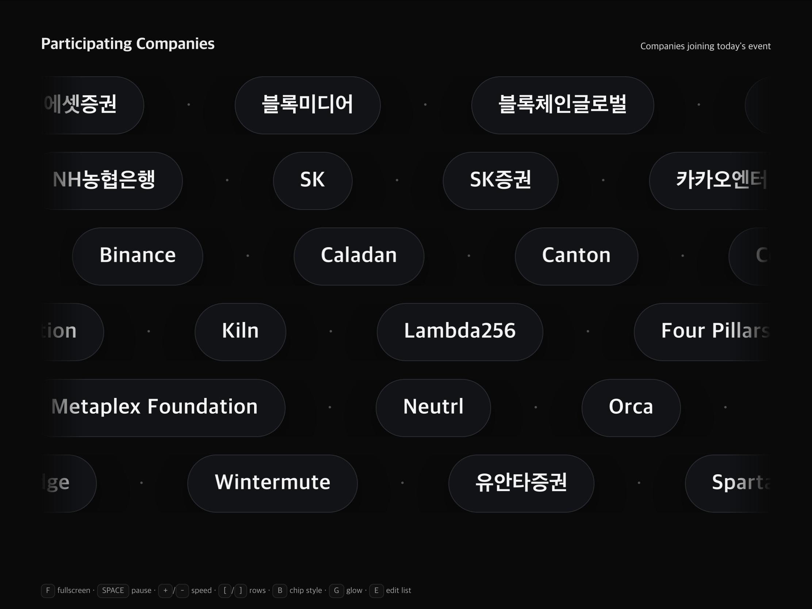

# Participating Companies — Infinite Scroller

행사 참가 기업 — 무한 스크롤러

A lightweight, projector-ready HTML page that continuously scrolls the names of participating companies at an event.  
행사에서 참여 기업들의 이름을 끊김 없이 스크롤로 보여주는, 빔프로젝터 친화적인 HTML 페이지입니다.

---

## ✨ Features / 기능

-   **Simple data input**: Add company names line by line in `companies.txt`.  
    **간단한 데이터 입력**: `companies.txt` 파일에 기업 이름을 한 줄씩 추가하면 됩니다.

-   **Projector-friendly design**: Dark background, high-contrast text, KR/EN mixed font support.  
    **프로젝터 친화적 디자인**: 어두운 배경, 높은 대비, 한글/영문 혼합 표시 지원.

-   **Infinite marquee effect**: Smooth, continuous scrolling with no blank gaps.  
    **무한 마퀴 효과**: 빈 공간 없이 부드럽게 이어지는 스크롤.

-   **Keyboard controls** (for live adjustments) / **키보드 단축키**:
    -   **F** → fullscreen / 전체화면
    -   **Space** → pause/resume / 일시정지·재생
    -   **+ / -** → adjust speed / 속도 조절
    -   **[ / ]** → adjust number of rows / 행 개수 조절
    -   **B** → toggle chip style / 칩 스타일 전환
    -   **G** → toggle glow effect / 글로우 효과 전환
    -   **E** → open in-browser editor / 편집기 열기

---

## 🚀 Getting Started / 시작하기

### 1. Clone or Download / 클론 또는 다운로드

```bash
git clone https://github.com/your-username/infinite-scroller.git
cd infinite-scroller
```

### 2. Add Company List / 기업 목록 추가

Create a `companies.txt` file in the same directory.  
각 기업 이름을 줄바꿈으로 구분해 `companies.txt` 파일에 작성하세요.

Example / 예시:

```
신한투자증권
NAVER
카카오
LG CNS
Samsung SDS
NHN Cloud
Coupang
```

### 3. Open in Browser / 브라우저에서 열기

Simply open `index.html` in your browser.  
브라우저에서 `index.html` 파일을 열면 됩니다.

-   Use **E key → Load companies.txt** to load your list.
-   **E 키 → Load companies.txt** 버튼으로 기업 리스트를 불러올 수 있습니다.
-   Or paste names directly into the editor.
-   또는 편집기에 직접 붙여 넣을 수도 있습니다.

---

## 🖥️ Demo / 데모



---

## 🛠️ Customization / 커스터마이징

-   **Title & Subtitle** can be changed in `index.html`.  
    **제목과 부제목**은 `index.html`에서 변경 가능합니다.

-   **Styling** (colors, gaps, chip style) is controlled via CSS variables.  
    **디자인 요소**(색상, 간격, 칩 스타일)는 CSS 변수로 조정할 수 있습니다.

-   **Animation speed, rows, and effects** can be tuned live with keyboard controls.  
    **애니메이션 속도, 행 수, 효과**는 키보드 단축키로 실시간 조정 가능합니다.

---

## 📂 Project Structure / 프로젝트 구조

```
.
├── index.html       # Main HTML file with inline CSS/JS / 메인 HTML 파일
├── companies.txt    # Company names (one per line) / 기업 이름 목록
├── screenshot.png    # Screen shot image / 스크린샷 이미지
└── README.md        # Project documentation / 문서
```

---

## 📜 License / 라이선스

This project is licensed under the **MIT License**.  
본 프로젝트는 **MIT 라이선스**로 배포됩니다.

You are free to **use, copy, modify, merge, publish, distribute, sublicense, and/or sell** copies of the Software.  
누구나 자유롭게 **사용, 수정, 배포, 상업적 활용**할 수 있습니다.

---

## 🙌 Acknowledgements / 감사의 말

-   Fonts: Noto Sans KR, system UI fonts
-   Designed for event organizers to quickly display sponsor/partner/company lists
-   행사 주최 측이 빠르게 **후원사·파트너사·참여 기업 목록**을 보여줄 수 있도록 설계되었습니다.
